# Direct LiDAR Odometry: <br> Fast Localization with Dense Point Clouds

## SC-DLO: SC-DLO-GTSAM
给 [DLO](https://github.com/vectr-ucla/direct_lidar_odometry) 这个高精度轻量级的**纯激光**里程计 Odometry 加上连续激光因子和回环因子, 回环检测的方法采用的 [Scan Context](https://github.com/gisbi-kim/SC-A-LOAM/blob/main/src/laserPosegraphOptimization.cpp), 后端优化使用 [GTSAM 4.0.3](https://github.com/borglab/gtsam/releases/tag/4.0.3), 代码框架基本沿用 [SC-A-LOAM](https://github.com/gisbi-kim/SC-A-LOAM) 的框架.

#### 效果
数据集来自高博的[自动驾驶中的SLAM技术](https://github.com/gaoxiang12/slam_in_autonomous_driving)仓库所提供的 [ulhk test2.bag](https://onedrive.live.com/?authkey=%21AHo6FMAmh0XGnLU&id=1A7361D22C554503%2191934&cid=1A7361D22C554503) 数据集
<p align="center">
    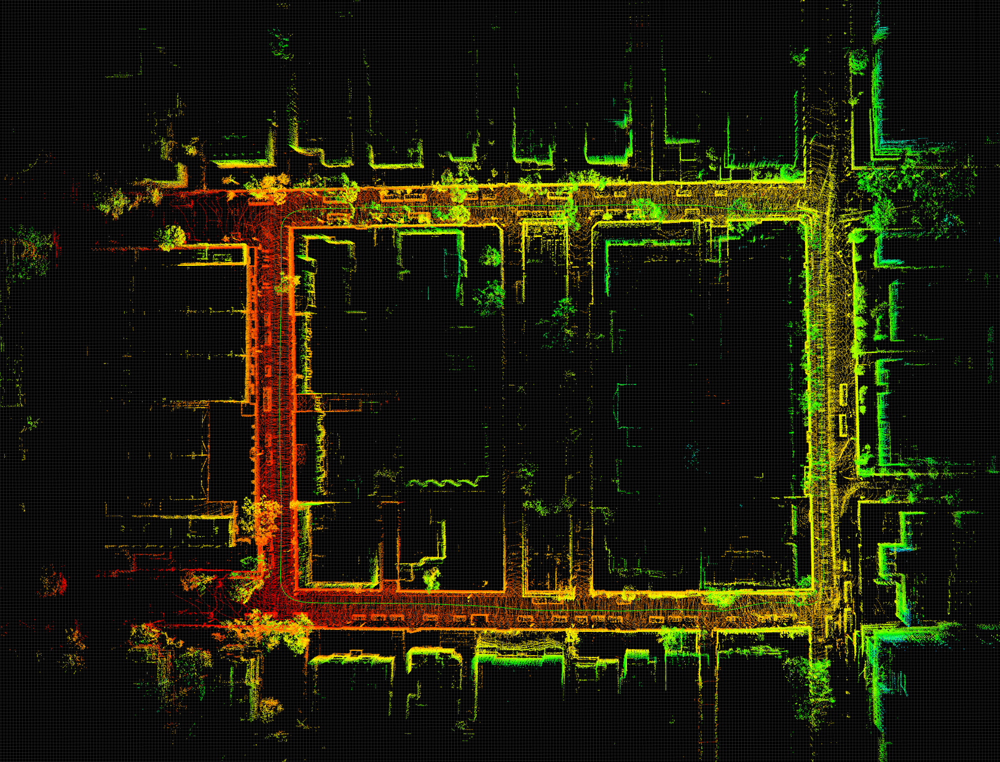
    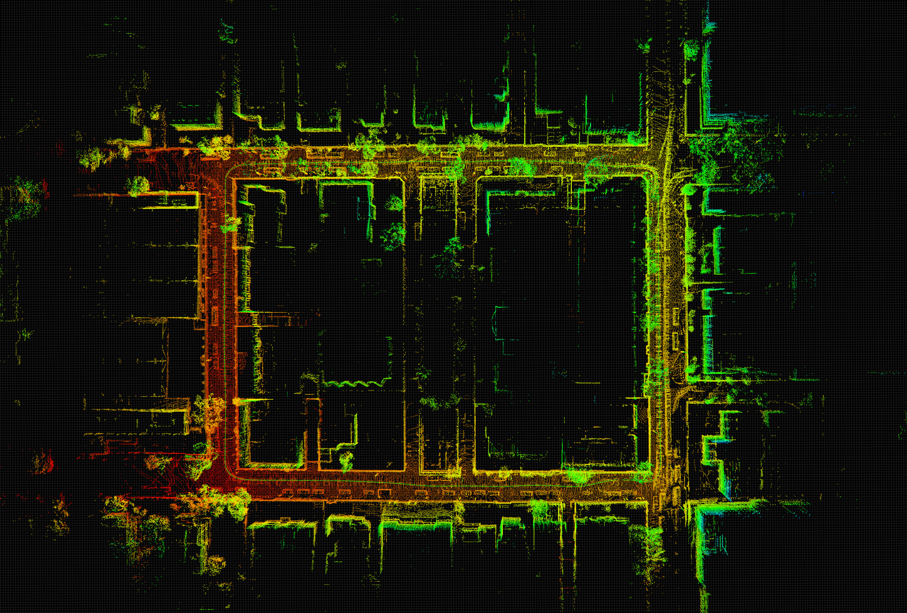
    <br>
    <em>左图是无后端优化的 DLO Odometry, 右图是 SC-DLO.</em>
</p>

**为什么?:** 虽然说 dlo 本身作为一个纯激光的里程计(基于 GICP )的效果已经非常好了(经过调参可以达到比较好的效果), 但是在比较大或者动态物体较多的场景下在回环的时候地图还是会有些错位, 因此加上了后端优化把地图拉回来.

<p align="center">
    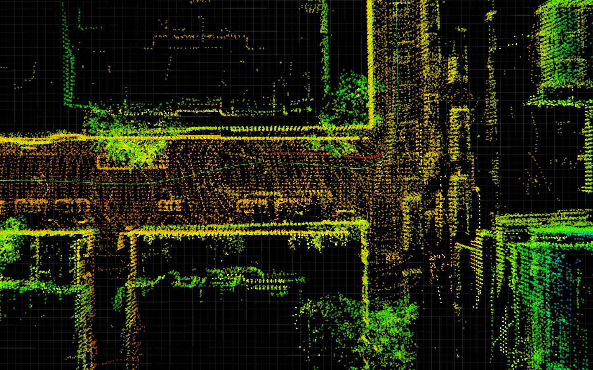
    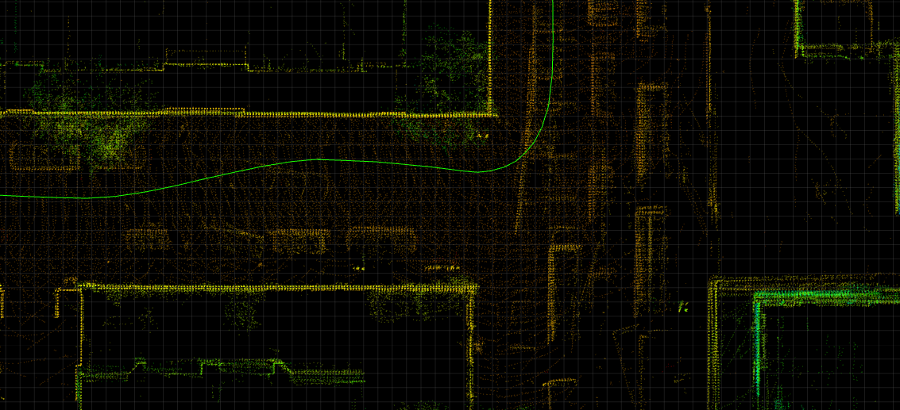
    <br>
    <em>细节对比: 左图是无后端优化的 DLO Odometry, 右图是 SC-DLO</em>
</p>

**其他效果:**

<p align="center">
    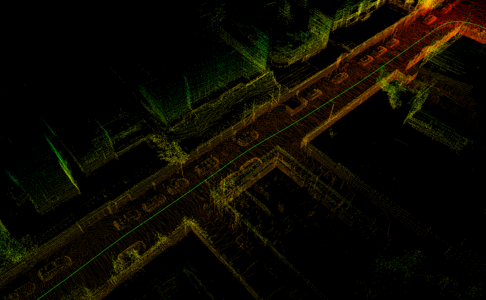
</p>

<!-- <table>
  <thead>
    <tr>
      <th colspan="6">Global Map with Dynamic Objects in Red</th>
    </tr>
  </thead>
  <tbody>
    <tr align="center">
      <td> 00 </td><td> 01 </td><td> 02 </td><td> 03 </td><td> 05 </td><td> 04 </td>
    </tr>
  </tbody>
  <tbody>
    <tr>
      <td> <p align="center"></p> </td>
      <td> <p align="center"></p> </td>
      <td> <p align="center"></p> </td>
      <td> <p align="center"></p> </td>
      <td> <p align="center"></p> </td>
      <td> <p align="center"></p> </td>
    </tr>
  </tbody>
  </tbody>
</table> -->
#### 运行
```C++
roslaunch direct_lidar_odometry sc_dlo.launch
```


#### DLO link: [[IEEE RA-L](https://ieeexplore.ieee.org/document/9681177)] [[ArXiv](https://arxiv.org/abs/2110.00605)] [[Video](https://www.youtube.com/watch?v=APot6QP_wvg)] [[Code](https://github.com/vectr-ucla/direct_lidar_odometry)]

DLO is a lightweight and computationally-efficient frontend LiDAR odometry solution with consistent and accurate localization. It features several algorithmic innovations that increase speed, accuracy, and robustness of pose estimation in perceptually-challenging environments and has been extensively tested on aerial and legged robots.

This work was part of NASA JPL Team CoSTAR's research and development efforts for the DARPA Subterranean Challenge, in which DLO was the primary state estimation component for our fleet of autonomous aerial vehicles.

<br>
<p align="center">
    
    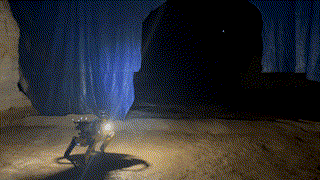
</p>
<p align="center">
    
</p>

## Instructions
DLO requires an input point cloud of type `sensor_msgs::PointCloud2` with an optional IMU input of type `sensor_msgs::Imu`. Note that although IMU data is not required, it can be used for initial gravity alignment and will help with point cloud registration.

### Dependencies
Our system has been tested extensively on both Ubuntu 18.04 Bionic with ROS Melodic and Ubuntu 20.04 Focal with ROS Noetic, although other versions may work. The following configuration with required dependencies has been verified to be compatible:

- Ubuntu 18.04 or 20.04
- ROS Melodic or Noetic (`roscpp`, `std_msgs`, `sensor_msgs`, `geometry_msgs`, `pcl_ros`)
- C++ 14
- CMake >= `3.16.3`
- OpenMP >= `4.5`
- Point Cloud Library >= `1.10.0`
- Eigen >= `3.3.7`

Installing the binaries from Aptitude should work though:
```sh
sudo apt install libomp-dev libpcl-dev libeigen3-dev 
```

### Compiling
Create a catkin workspace, clone the `direct_lidar_odometry` repository into the `src` folder, and compile via the [`catkin_tools`](https://catkin-tools.readthedocs.io/en/latest/) package (or [`catkin_make`](http://wiki.ros.org/catkin/commands/catkin_make) if preferred):
```sh
mkdir ws && cd ws && mkdir src && catkin init && cd src
git clone https://github.com/vectr-ucla/direct_lidar_odometry.git
catkin build
```

### Execution
After sourcing the workspace, launch the DLO odometry and mapping ROS nodes via:

```sh
roslaunch direct_lidar_odometry dlo.launch \
  pointcloud_topic:=/robot/velodyne_points \
  imu_topic:=/robot/vn100/imu
```

Make sure to edit the `pointcloud_topic` and `imu_topic` input arguments with your specific topics. If an IMU is not being used, set the `dlo/imu` ROS param to `false` in `cfg/dlo.yaml`. However, if IMU data is available, please allow DLO to calibrate and gravity align for three seconds before moving. Note that the current implementation assumes that LiDAR and IMU coordinate frames coincide, so please make sure that the sensors are physically mounted near each other.

If successful, RViz will open and you will see similar terminal outputs to the following:

<p align='center'>
    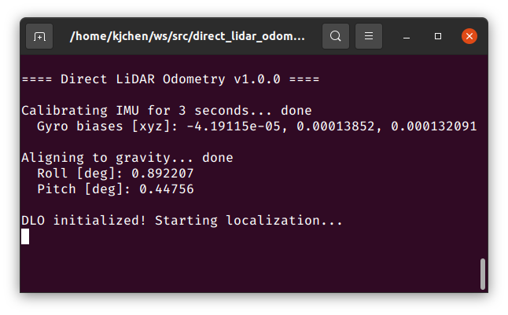
    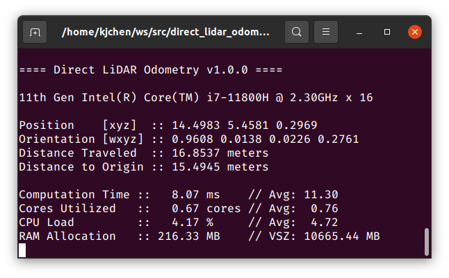
</p>

### Services
To save DLO's generated map into `.pcd` format, call the following service:

```sh
rosservice call /robot/dlo_map/save_pcd LEAF_SIZE SAVE_PATH
```
To save the trajectory in KITTI format, call the following service:

```sh
rosservice call /robot/dlo_odom/save_traj SAVE_PATH
```

### Test Data
For your convenience, we provide example test data [here](https://ucla.box.com/shared/static/ziojd3auzp0zzcgwb1ucau9anh69xwv9.bag) (9 minutes, ~4.2GB). To run, first launch DLO (with default point cloud and IMU topics) via:

```sh
roslaunch direct_lidar_odometry dlo.launch
```

In a separate terminal session, play back the downloaded bag:

```sh
rosbag play dlo_test.bag
```

<p align='center'>
    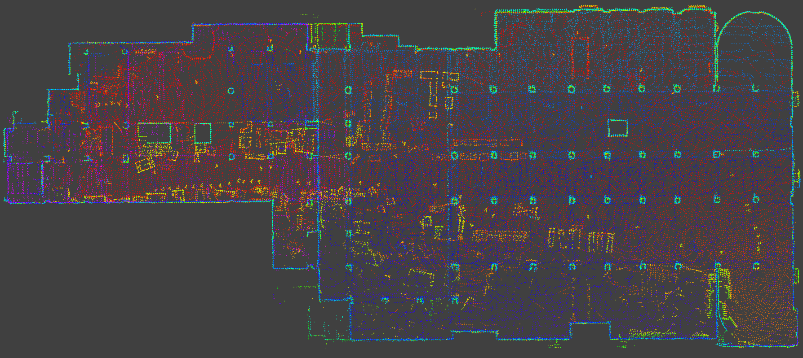
</p>

## Citation
If you found this work useful, please cite our manuscript:

```bibtex
@article{chen2022direct,
  author={Chen, Kenny and Lopez, Brett T. and Agha-mohammadi, Ali-akbar and Mehta, Ankur},
  journal={IEEE Robotics and Automation Letters}, 
  title={Direct LiDAR Odometry: Fast Localization With Dense Point Clouds}, 
  year={2022},
  volume={7},
  number={2},
  pages={2000-2007},
  doi={10.1109/LRA.2022.3142739}
}
```

## Acknowledgements

We thank the authors of the [FastGICP](https://github.com/SMRT-AIST/fast_gicp) and [NanoFLANN](https://github.com/jlblancoc/nanoflann) open-source packages:

- Kenji Koide, Masashi Yokozuka, Shuji Oishi, and Atsuhiko Banno, “Voxelized GICP for Fast and Accurate 3D Point Cloud Registration,” in _IEEE International Conference on Robotics and Automation (ICRA)_, IEEE, 2021, pp. 11 054–11 059.
- Jose Luis Blanco and Pranjal Kumar Rai, “NanoFLANN: a C++ Header-Only Fork of FLANN, A Library for Nearest Neighbor (NN) with KD-Trees,” https://github.com/jlblancoc/nanoflann, 2014.

## License
This work is licensed under the terms of the MIT license.

<br>
<p align='center'>
    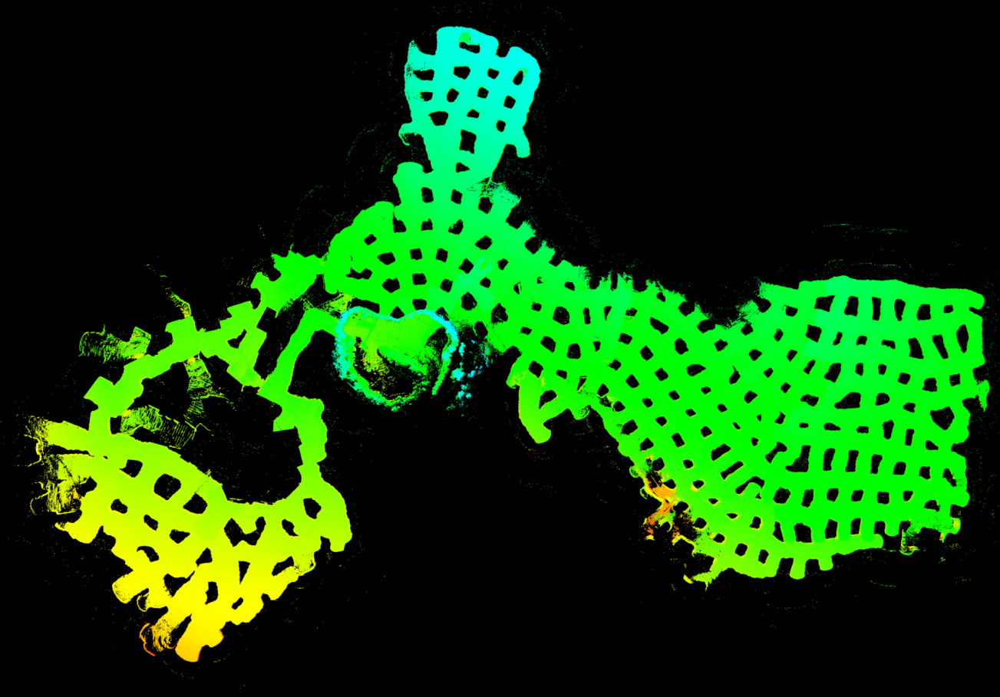
    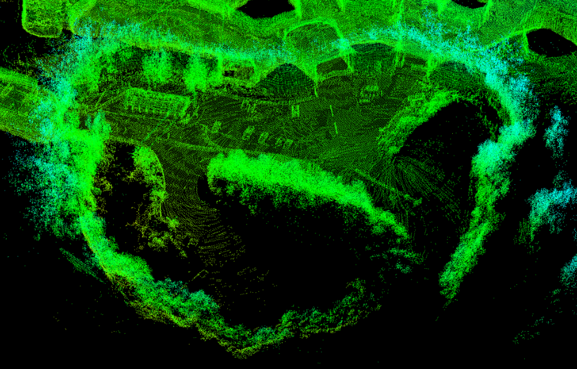
</p>
<p align="center">
    
    
</p>
